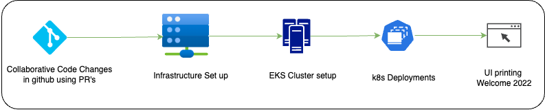

# Readme
# Setting up EKS Cluster with Terraform and Deploying Flask Application

This guide provides step-by-step instructions on how to set up an Amazon EKS (Elastic Kubernetes Service) cluster using Terraform and deploy a Flask application into the EKS cluster. Additionally, the application deployment is automated through GitHub Actions using a Helm chart.

## Prerequisites

- [Terraform](https://www.terraform.io/downloads.html) installed on your local machine.
- [AWS CLI](https://aws.amazon.com/cli/) installed and configured with appropriate credentials [Development Purpose].
- [kubectl](https://kubernetes.io/docs/tasks/tools/install-kubectl/) installed for interacting with the Kubernetes cluster [Development Purpose].
- [Helm](https://helm.sh/docs/intro/install/) installed for managing Kubernetes applications [Development Purpose].

## Setup Application onto EKS Cluster

I have containerized a Python Flask App using Docker and deployed the App to a EKS (Elastic Kubernetes Service) cluster using a CI/CD pipeline called Github actions which come inbuilt along with GitHub. I have associated the pipeline's one end to the Github repository (containing the application code), and connected the other end to the EKS cluster. The EKS Cluster is set up using Terraform Code in local machine and the state file is stored in aws s3 bucket. Below is the architecture diagram of the deployed App :

## Application setup Structure
 * __.github/workflows__ -> The deployment yaml job is to Build the Docker Image taking input from Dockerfile and Deploy to EKS Cluster. In deployment.yaml we have used workflow_dispatch so that on every Pull Request getting merge to main branch that shouldn't trigger a build and deploy. However, if that is a requirement we have put code commented for push against `main` branch.
 * __app-helm-chart__ -> Here we have templates directory which contains the template for `deployment.yaml and service.yaml`, and outside the `charts.yaml` and `values.yaml` Template directory is created so that we can apply the same helm chart version against multiple environments.
 * __application__ -> The application Directory contains the source code for the application. In this case we have a python program which lies under `src` directory under `application` containing `app.py`. Also we have `requirements.txt` which basically helps in installing the necessary packages required by `pip` command to install for the application.
 * __infra-setup__ -> This directory contains setting up of EKS Cluster in AWS using Terraform. We have used module like vpc, eks as using modules in IaC promotes good software engineering practices, making your infrastructure code more maintainable, reusable, and readable.
 * __Dockerfile__ > This File contains the containerisation of the Python application lying under `application/src/app.py`

## Can It be Better

Certainly, we have taken the route of exposing the service via Loadbalancer. However if we have mulitple services we would be creating unnecessary Load balancer's which will cost us.
So we can take route of creating Ingress and pointing the backend to the service, or we can use advance traffic management tools like istio creating Gateway and Virtual Service.
